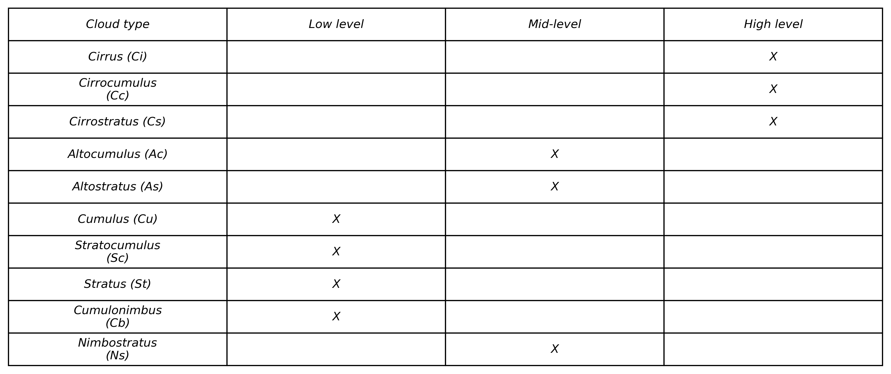
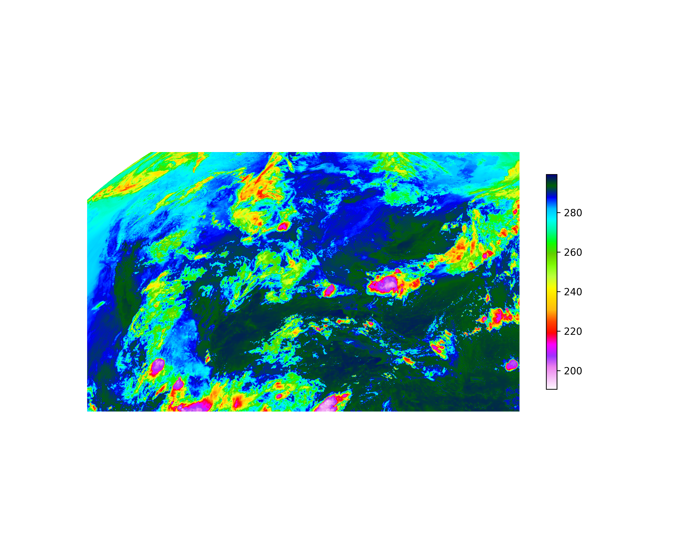

# Machine Learning Cloud Classification using Satellite Imagery 

Authors: Paul Eldridge and Lindsay Briggs 

## 1. Introduction and Background 


This cloud classification machine learning model was developed as a part of the EAE 495: Data 
Science for the Geosciences course at Northern Illinois University under Dr. Alex Haberlie. In 
atmospheric science and meteorology alike, clouds have a significant influence on temperature 
and are the source of precipitation (i.e. rain, snow, hail). Clouds give vital insight to forecasters 
and weather scientists of current conditions in the atmosphere. Identifying cloud types via 
satellite can provide another method of estimating rainfall rates.

### Definition of a cloud

A cloud is defined as “a hydrometeor consisting of minute particles of liquid water or ice, or of both, suspended in the atmosphere and usually not touching the ground. It may also include larger particles of liquid water or ice, as well as non-aqueous liquid or solid particles such as those present in fumes, smoke or dust” (WMO 2017).




> Table 1. Clouds and their classifications. Adapted from Guzel et al. (2024).

There are ten basic cloud types that are categorized into three sub classifications based on their heights (Table 1)(Study where I got table?). Cirrus (Ci), Cirrostratus (Cs), and Cirrocumulus (Cc) are high level-clouds. Low-level clouds consist of Cumulus (Cu), Stratocumulus (Sc), Stratus (St), Cumulonimbus (Sb), and Nimbostratus (Ns). Mid-level clouds consist of Altostratus (As) and Altocumulus (Ac) (Guzel et al. 2024).


> Figure 1.  Clouds and their classifications by height (WMO 2017).

The Cirrus (Ci) genus is "composed of detached cirriform elements in the form of white, delicate filaments, of white (or mostly white) patches, or of narrow bands" (AMS 2024). Ci are entirely made up of ice crystals. The extent of transparent appearance is dependant upon the degree of ice crystal seperation (NOAA 2023). The Stratus (St) genus is characterized by its generally featureless-uniform base, and its appearance of being a long milky white-grey layer.  St can produce drizzle, ice prisms or snow grains if the cloud is thick enough (NOAA 2023). Cumulus (Cu) clouds are "individual, detached elements that are generally dense and posses sharp nonfibrous outlines" (AMS 2024). Cu commonly grows into cumulunimbus or cumulus congestus, which then produce precipitation. 

The aim of this machine learner is not to predict the severity or convective mode produced, but 
rather to identify the type of cloud depicted in satellite imagery. Machine learning can be trained to recognize cloud types from different sources such as ground 
based image observations from the surface, satellite imagery and climate models. An issue with 
ground-based imagery is that this method would not be as effective at night due to photos losing 
contrast during nighttime. This is where our second and third methods come into play. By 
training the CCM on satellite imagery, a product such as Long Wave Infrared, clouds would be 
able to be depicted after nightfall to allow our model to function during dark hours.

### Note:
Due to unforseen circumstances toward the end of the semester, work on the model had to be halted for extended periods of time. This model is by all means a work in progress and will be updated as time goes on.

## 2. Literature 

The dataset within the study “Cloud type classification using deep learning with cloud images”  comprised of 11 folders of pictures, representing a cloud type, the 
eleventh type being contrails. Contrails were included due to similarities in appearance from 
ground observations. There was a total of 2,543 images. The dataset split consisted of 70% 
training, 20% validation, and 10% for the test dataset. Their split was random but maintained 
balanced. 

This study used data from the Himawari-8 satellite and the cloud type product 2B-CLDCLASS-
LIDAR. 130 days of data were selected from the months November 2018, January 2019, March 
2019, June 2019, and July 2019. The Himawari-8 CLTYPE products encompassed ten cloud 
types (clear-sky (Clear), cirrus (Ci), deep convective (Dc), altostratus (As), altocumulus (Ac), 
nimbostratus (Ns), stratocumulus (Sc), stratus (St), and cumulus (Cu)). CPR/CALIOP products consisted of 9 types. For the purpose of consistency, clouds were classified into 9 types, merging 
Ci and Cs. Cu has the poorest classification performance during daytime and nighttime (Fu, Y., et al 2023). 

https://github.com/tpmao/cloud-classification-data

The cloud classification model was based off data from Geostationary Operational Enviromental 
Satellite (GOES)16, formerly known as GOES-R, using its Long Wave Infared radiation (LWIR) 
Product. The NOAA s3 bucket was used on AWS to download data. This bucket is part of the 
Registry of Open Data on AWS and can be accessed anonymously at no cost to the user. See 
https://registry.opendata.aws/ for more information. CONUS images were used as opposed to 
full disk images due to the file size. GOES images are stored as netCDF files with each advanced 
baseline imager (ABI) band stored in a different file for a given time. Band 13 (longwave 
infrared radiation) is the specific ABI band of interest to us. These files also contain data about 
the position of the satellite at the time the image was taken. This information was then used to 
convert the “x” and “y” coordinates of the image into degrees of latitude and longitude to flatten 
the image. Each image also contains “nan” data points – these occur at places where the sensor is 
peering into space and not at the earth. These values were masked over to allow for image 
flattening. Each image was then cropped to a set size to ensure uniformity.

## 3. Methodology
1.  Data Collection

GOES Satellite imagery was used, specifically advanced baseline imager (ABI) band 13, clean longwave infrared radiation. This data was accessed through the National Oceanic and Atmospheric Administration (NOAA) s3 bucket on Amazon Web Services (AWS). This bucket is part of the Registry of Open Data on AWS and can be accessed anonymously at no cost to the user. See https://registry.opendata.aws/ for more information. Images of the contiguous United States (CONUS) were used as opposed to full disk images due to the file size. 

GOES images are stored as netCDF files with each advanced baseline imager (ABI) band stored in a different file for a given time. Band 13 (clean longwave infrared radiation) is the specific ABI band of interest to us. These netCDF files contain:
 - The time the image was taken (as an average between the start of the first and last scan), in seconds.
 - GOES fixed projection: the x and y coordinates of each pixel.
 - The center x and y coordinates of the image.
 - The central wavelength of each band (16 in total).
 - Each band ID (16 in total).
 - Each ABI band (16 in total) and a quality flag for each band (16 in total).
 - Many more variables (124 total), including min/max brightness for each band, information about the satellite's position, etc. 

Each dataset was saved to a folder in Google Drive. In total, 100 datasets were downloaded with an additional 45 downloaded at a later time for model testing. 

2.  Preprocessing

Each satellite image can be viewed by accessing a certain band and using ```matplotlib```'s ```imshow()``` to view. For example, looking at a random ABI band 13 image yields:

>Figure 2. CONUS ABI band 13 image.

matplotlib's ```'gist_ncar_r'``` colormap was used due to its wide range of colors. 

NaNs existed within the raw data due to the angle of the satellite images. To account for this, cloud features were extracted on colab using a temperature mask. This mask was set to filter out any temperatures greater than 270 Kelvin. To extract each cloud feature from the overall image, ```scipy's ndimage``` was used to find unique areas. 
```
dataset = xr.open_dataset('sample_dataset') # Open a sample dataset
CMI = dataset.CMI_C13 # ABI Band 13

cmap = cm['gist_ncar_r'].copy() # Colormap
cmap.set_bad(color='gray') # Setting any missing/nan values to gray to make it look nice

temperature_mask = CMI.where(CMI.data <= 270) # Masking any data points over 270 Kelvin. This should isolate any important cloud features.

mask = CMI.data < 270 # Mask that works with scipy ```label``` function. This creates an array of True/False values.

labeled_array, num_features = ndimage.label(mask) # Returns ```labeled_array```, which returns the array with each unique feature labeled with a different number. 
# Also returns ```num_features```, which is the number of unique features found. 
region_sizes = ndimage.sum_labels(mask, labeled_array, range(1, num_features + 1)) # Calculates the sum, or in this case, the "area", of each unique feature. 

min_size = 5000 # Arbitrarily chosen minimum size
region_mask = np.zeros_like(mask, dtype= bool) # Array with the same shape as our original array but with all Falses. This will be iterated over in order to flip needed values to True.

for i, size in enumerate(region_sizes): # Loop through region sizes while keeping track of the index. If the feature is larger than the minimum size, ```region_mask```
        if size >= min_size:            # is updated to True. 
            region_mask = region_mask | (labeled_array == (i + 1))
        
cleaned_CMI = CMI.where(region_mask) # recreating our mask from before, now with only the large important features.

filtered_labels, new_features = ndimage.label(region_mask) # Labeling unique features within our new filtered mask, similar to before. 
features = [] # Creates an empty list that each unique feature will be stored in.

for label in range(1, new_features + 1):  # Iterating through the number of unique features found.
    feature_mask = filtered_labels == label # Creating a temporary array of True/False where only the feature with the number associated with ```label``` is labeled as "True".
    
    CMI_feature = CMI.where(feature_mask)  # Creates temporary mask that only lets the unique feature show.
    
    coords = np.argwhere(feature_mask) # Finds indicies of our feature.
    ymin, xmin = coords.min(axis= 0) # Gives the minimum x and y values.
    ymax, xmax = coords.max(axis= 0) + 1 # Gives the maximum x and y values.
    
    cropped = CMI_feature.isel(y= slice(ymin, ymax), x= slice(xmin, xmax)) # Slicing into dataarray with our x and y coordinates in order to isolate them. 
    features.append(cropped) # Feature is added to our list. 
```

Each feature then needed to be resized to a desired shape in order to be passed into a CNN. Through testing, it was found that 128x128 pixels offered a good balance of feature preservation while not taking up too much space.

```
shape = 128 # Desired side length of image. We will make these square, so we only need the size of one side since they will all be the same.
resized_features = [] # Empty list to store the resized features.

for feature in features:
    data = feature.data # Extract the values from each feature.
    
    if np.all(np.isnan(data)): # If entire feature is nan values, skip it. 
        continue
    
    filled_data = np.nan_to_num(data) # Filling nan values within feature to numeric so they plot nicely.
    zoom = (shape / filled_data.shape[0], shape / filled_data.shape[1]) # Zoom factor for each dimension. 
    resized_data = ndimage.zoom(filled_data, zoom, order= 1) # Resizes the image. 
    
    resized_features.append(resized_data) # Add the resized image to the list.
    
```
Each feature was then converted to an image and stored in a folder on Google Drive. In total, 1047 initial images were created, and another 474 were created later for further testing. These images were then stored in a pandas ```DataFrame``` whiched was saved as a pickle in Google Drive.

Due to time limitations, not every image was able to receive a label. However, about 100 images were labeled by opening the image and prompting the user to select a label: Cumulus, Stratus, or Cirrus. These classifications were highly subjective and may vary from user to user. This is a source of error within this project and will be adjusted later to make the labeling process more objective. There exists an issue on Colab where matplotlib and the ```input()``` function do not work well together and periodically the webpage must be refreshed in order for the script to run normally. This significantly slowed down the labeling process.

3.  Model Selection
   
The original plan was to train a convolutional neural network with 5,000 images split into train, validation, and test datasets. Due to unforeseen circumstances, labeling 5,000 images on Colab was not able to be done and only about 100 images were labeled. In order to have some sort of deliverable, the decision was made to train a CNN with most of the small labeled subset and validate it with the rest of the labeled images. Then, the rest of the feature images could be passed in as a test with the model returning the image and it's highest confidence.  

4.  Training and Validation

Tensorflow's ```keras``` was used due to our familiarity with it. The model was trained on 100 epochs with a batch size of 32. 20% of the labeled images were used as validation. Before training, all images were normalized to obtain a value per pixel between 0 and 1. The dataframe containing the images was then split into two subsets; the labeled set and the unlabeled set. The labeled data was then given to the mode. The model had memorized the training data by the 16th epoch but was never able to break 90 % accuracy on the validation subset. Diminishing returns were present by around the 40th epoch, where the validation accuracy plateaued and then preceeded to get worse.

>Figure 3. CNN training and validation accuracy w.r.t. epoch number.


5.  Testing and Evaluation

The model was first given the original unlabeled image subset. The images were un-normalized after being given a predicted label and the new predicted label was added to the dataframe. A function was written to display sample predictions for all three classes. The model's confidence for each prediction was also kept and analyzed. 


## 4. Results
### 4a. Model Performance

>Figure 4. Sample predictions from the original unlabeled dataset.


>Figure 5. Sample Predictions from the second test dataset.

The model's confidence for all classes was also assessed. 


>Figure 6. Breakdown of the model's predictions as well as the portion of predictions where confidence was less than 80% (0.8).

The model had high confidence for most cumulus and stratus cases, however every single stratus case had a confidence of less than 80%. This is most likely due to the subjective nature of the classifications and the disparity between the number of occurrences of each feature in the dataset. 


>Figure 7. Histograms showing the distribution of confidence for each classification made by the model on the first dataset.


>Figure 8. Histograms showing the distribution of confidence for each classification made by the model on the second dataset.

Both tests yielded similarly-shaped distributions, indicating that the model is at the very least, consistent. The total classifications for the unlabeled dataset were:
 	
|label|count|
|-|-|
|Cumulus |688|
|Stratus|224|
|Cirrus|9|
>Table 2. Total classifications for the first unlabeled dataset.

For the second test dataset:

|label|count
|-|-|
|Cumulus|343
|Stratus|125
|Cirrus|6
>Table 3. Total classifications for the second unlabeled datast.

### 4b. Work to be Continued

There are many things that can be done to improve the model. 
1. Re-write the download script:
    - The download script fails to download datasets about half of the time. This is most likely because the script is running to fast and needs to be slowed down. The script can also be improved by downloading datasets in parallel as opposed to in series. This would shorten the time taken to run the script and allow for more files to be downloaded at a time.
2. Improve feature filtering:
    - The current feature filtering uses a mask that filters out any pixels greater than 270 K. Research on our end must be done to figure out either: a) A different temperature threshold to better capture cirrus clouds, or: b) A new way to filter out individual cloud types, separating different cloud types from within individual features.
3. Streamline the labeling process:
    - The current labeling method is extremely subjective and must ignore cloud types that are not the most prominent feature in an image. Some features need to be filtered out because they are not fully captured by the satellite (the feature is partially on the non-visible side of the globe). Parameters need to be determined on how to classify the images. More work needs to be put into the labeling script to either work better on Colab or to be moved to a local environment where the issue described with Colab and matplotlib does not happen.
4.  Fine-tune the model:
     - The current model was not modified in any way after its initialization. With more time, work can be done on the model to add more convolutional layers and optimize other areas such as the optimal number of epochs.
 
## 5. References 

AMS, 2024: Cirrus. Glossary of Meteorology, American Meteorological Society, https://glossary.ametsoc.org/wiki/Cirrus.

AMS, 2024: Cumulus. Glossary of Meteorology, American Meteorological Society, https://glossary.ametsoc.org/wiki/Cumulus.

Fu, Y., X. Mi, Z. Han, W. Zhang, Q. Liu, X. Gu, and T. Yu, 2023: A machine-learning-based study on all-day cloud classification using Himawari-8 infrared data. *Remote Sens.*, 15, 5630, https://doi.org/10.3390/rs15245630.

Gensini, V. A., C. Converse, W. S. Ashley, and M. Taszarek, 2021: Machine Learning Classification of Significant Tornadoes and Hail in the United States Using ERA5 Proximity Soundings. Wea. Forecasting, 36, 2143–2160, https://doi.org/10.1175/WAF-D-21-0056.1.

Guzel M, Kalkan M, Bostanci E, Acici K, Asuroglu T. Cloud type classification using deep learning with cloud images. PeerJ Comput Sci. 2024 Jan 3;10:e1779. doi: 10.7717/peerj-cs.1779. PMID: 38196950; PMCID: PMC10773838.

NOAA, 2023: Ten Basic Clouds. JetStream: An Online School for Weather, *National Oceanic and Atmospheric Administration*, https://www.noaa.gov/jetstream/clouds/ten-basic-clouds.

WMO, 2017: Clouds. International Cloud Atlas, World Meteorological Organization, https://cloudatlas.wmo.int/en/clouds.html.

WMO, 2017: Definitions of clouds. *International Cloud Atlas*, World Meteorological Organization, https://cloudatlas.wmo.int/en/clouds-definitions.html

## Appendix 

# Requirements Document
| PELBCCM-01  | `   
|---------|------------| 
| Priority Level:|Urgent |
| Sprint | 1 |
| Assigned To | Paul Eldridge |
| User Story   | As a meteorologist, I want to be able to input a date and time and have the model classify the clouds found in the image.  |                                                                                                               
| Requirements | The user can input a specific time (year, month, day, hour). This timestamp can then be passed into a function that downloads every longwave IR image taken during the hour. |
| Acceptance Criteria | |
| Unit Test | | 

| PELBCCM-01  | Image Downloading   
|---------|------------| 
| Priority | High |
| Sprint | 1 |
| Assigned To | Paul |
| User Story   |  |                                                                                                                                       | 
| Requirements | |
| | 1. |
| | 2.|
| | 3. |
| | 4. |
| Acceptance Criteria | |
| | 1. |
| | 2. |
| | 3. . |
| | 4. .|
| Unit Test | | 
```
import numpy as np
import matplotlib.pyplot as plt
import xarray as xr
import pandas as pd
from matplotlib import colormaps as cm
from scipy import ndimage
import matplotlib.gridspec as gridspec
import os
!pip install s3fs
import warnings
warnings.filterwarnings('ignore')
import s3fs

from google.colab import drive
drive.mount('/content/drive')

def download_files(number_of_files):
    product = 'ABI-L2-MCMIPC'
    satellite = 'goes16'
    download_dir = '/content/drive/MyDrive/CCM/Datasets'

    # Check filepath:
    if not os.path.isdir(download_dir):
        os.makedirs(download_dir)

    num_files = 0
    max_attempts = 100
    attempts = 0

    fs = s3fs.S3FileSystem(anon= True)

    while num_files < number_of_files and attempts < max_attempts:
        attempts += 1

        year = np.random.randint(low= 2018, high= 2024)
        day = np.random.randint(low= 1, high= 366)
        hour= np.random.randint(low= 0, high= 23)

        s3_path = f'noaa-{satellite}/{product}/{year}/{day}/{hour}/'

        try:

            files = fs.ls(s3_path)
            if not files:
                continue

            file_to_download = np.random.choice(files)
            s3_file_path = f's3://{file_to_download}'
            local_file_path = os.path.join(download_dir, os.path.basename(file_to_download))

            print(f'Downloading {file_to_download}...')
            fs.get(s3_file_path, local_file_path)
            print('Success!')

            num_files = len(next(os.walk(download_dir))[2])

        except Exception as e:
            print(f'Failed to download from {s3_path}: {e}')
            continue

        if attempts >= max_attempts:
            print("Max attempts reached. Ending download.")

    print(f'Download complete: {num_files} files in {download_dir}')
```
| PELBCCM-01  | The user can view the image(s) if necessary`   
|---------|------------| 
| Priority | Level |
| Sprint | 1 |
| Assigned To | Name |
| User Story   | As a meteorologist, I want to be able to verify that the images are what I am expecting to 
see. |                                                                                                                                       | 
| Requirements | |
| | 1. |
| | 2.|
| | 3. |
| | 4. |
| Acceptance Criteria | |
| | 1. |
| | 2. |
| | 3. . |
| | 4. .|
| Unit Test | | 
```


```
